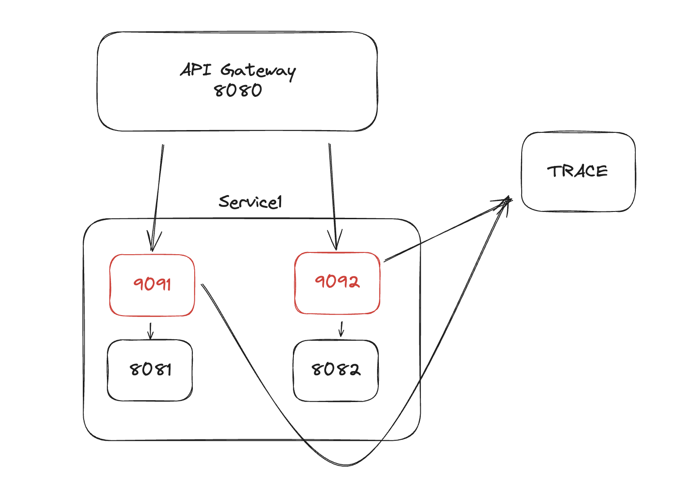

# Rust Api Gateway Uygulaması

Bu uygulama, Rust programlama dili ile yazılmış bir API Gateway uygulamasıdır. Uygulama, gelen istekleri belirli bir sıra ile işleyerek, arka tarafta bulunan servisler ile iletişim kurar ve sonuçları istemciye döner. Uygulama, aynı zamanda Round Robin Load Balancing, Caching gibi özellikleri de destekler. 

## Servisler

Uygulama, iki adet servis içerir. Bu servisler, `service1` ve `service2` olarak adlandırılmıştır. Her iki servis de Node.js ile yazılmıştır ve `service1` 8081 ve 8082 portunda, `service2` ise 8083 ve 8084 portunda çalışır.
[service1](./service1)
[service2](./service2)

## API Gateway

API Gateway uygulaması, Rust programlama dili ile yazılmıştır. Uygulama, gelen istekleri belirli bir sıra ile işleyerek, arka tarafta bulunan servisler ile iletişim kurar ve sonuçları istemciye döner. Uygulama, aynı zamanda Round Robin Load Balancing, Caching gibi özellikleri de destekler.
[rust-gate](./rust-gate)

## Sidecar Proxy

Sidecar Proxy uygulaması gelen istekleri ilgili servislere yönlendirmek için kullanılır. Bir service mesh mimarisi içerisinde kullanılabilir. Bu uygulama, Rust programlama dili ile yazılmıştır.
[sidecar-proxy](./rust-side-proxy)

## Yük Testi

Uygulamanın yük testini yapmak için `k6` aracını kullanabilirsiniz. Aşağıdaki komutu çalıştırarak 1000 istek gönderebilirsiniz.
[load-test](./load-test)

## Kullanılan Teknolojiler

- Rust

##  Özellikler

- Routing

- Round Robin Load Balancing

- Caching

- Sidecar Proxy


## Kullanım

Uygulamayı çalıştırmak için öncelikle Rust ve Node.js kurulu olmalıdır. Daha sonra aşağıdaki adımları takip edebilirsiniz.

1. Rust ile API Gateway uygulamasını çalıştırmak için aşağıdaki komutları çalıştırın.

```bash
cd rust-gate
cargo run
```

2. Node.js ile servisleri çalıştırmak için aşağıdaki komutları çalıştırın.

```bash
cd service1
npm start 8081
npm start 8082
http://localhost:8081/health
http://localhost:8082/health
```

```bash
cd service2
npm start 8083
npm start 8084
http://localhost:8083/health
http://localhost:8084/health
```

3. Tarayıcıdan `http://localhost:8080` adresine giderek uygulamayı kullanabilirsiniz.

```bash
http://localhost:8080/service1/health
http://localhost:8080/service2/health
```

4. Sidecar Proxy uygulamasını çalıştırmak için aşağıdaki komutları çalıştırın. İlk parametre sidecar proxy uygulamasının çalışacağı port, ikinci parametre ise yönlendirilecek servisin çalıştığı porttur.

```bash
cd rust-side-proxy
cargo run 9091 8081
cargo run 9092 8082
cargo run 9093 8083
cargo run 9094 8084
```

## Docker Compose ile Çalıştırmak

Uygulamayı Docker Compose ile çalıştırmak için aşağıdaki komutları çalıştırabilirsiniz.

```bash
## replace localhost => host.docker.internal and run
docker-compose up
```

## Yük Testi

Uygulamanın yük testini yapmak için `k6` aracını kullanabilirsiniz. Aşağıdaki komutu çalıştırarak 1000 istek gönderebilirsiniz.

```bash
cd load-test
k6 run index.js
```
